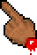

# nesticle theme

This repository contains the bloody hand cursor from the NES emulator
NESticle. The cursor was rendered and extracted via NESticle's code.

## Installation

Clone this repository in `~/.local/share/icons/`

    git clone https://github.com/FragmentedCurve/nesticle-theme.git ~/.local/share/icons/nesticle
	
Afterwards, add the following two lines to `~/.Xresources`

    Xcursor.theme: nesticle
    Xcursor.size: 32

Then run 

    xrdb -merge ~/.Xresources

